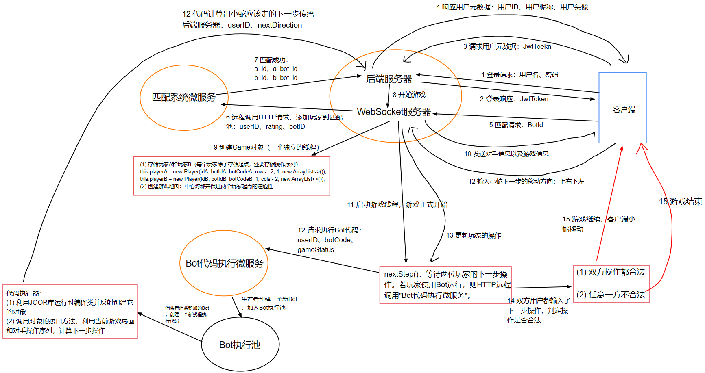
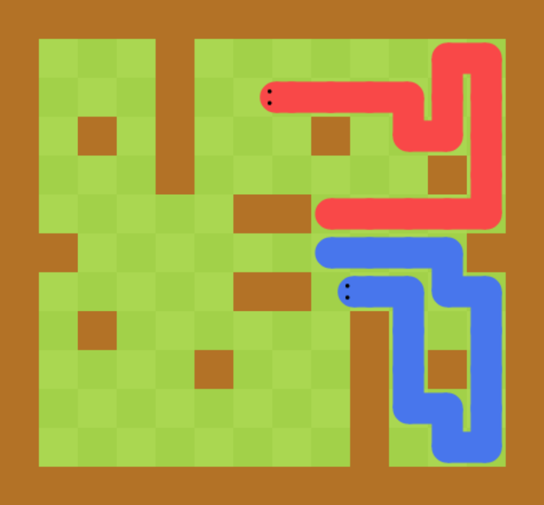

# 项目描述

该项目采用前后端分离架构，是一个多游戏实现的对战平台，提供自动运行游戏的接口供玩家实现，玩家根据自己的策略编写Bot代码，选择游戏后可以选择使用自己实现的Bot自动游戏对局。基于WebSocket协议建立游戏对局连接，JWT+Spring Security作登录验证，实现游戏匹配、玩家Bot对决、录像回放等功能。

**可玩游戏：**

- AI贪吃蛇（已完成）
- AI五子棋（正在做）
- AI斗地主（待做）
- ...

# 技术栈

- 前端：Vue + BootStrap
- 后端：Spring Boot + WebSocket + JWT + Spring Security + MySQL + Spring Cloud

# 通信流程

以AI贪吃蛇为例，举例说明游戏主项目的通信流程：

# 运行效果

匹配界面（可选择自己的Bot）：

AI贪吃蛇游戏对局界面：

